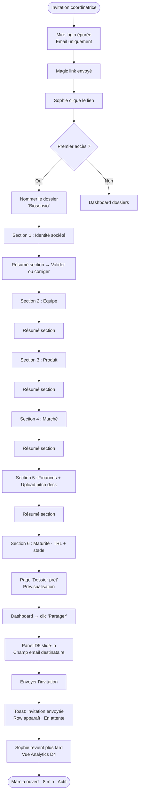
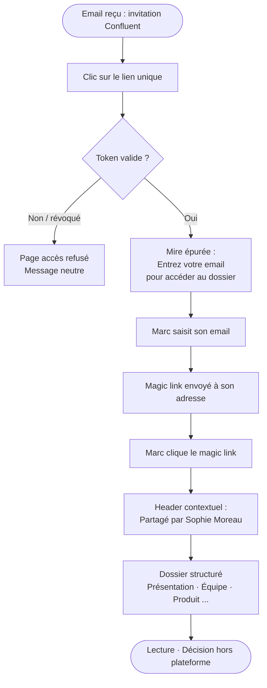
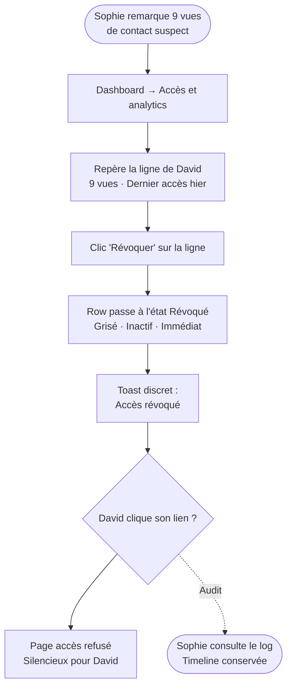

# UX Design Specification — confluent

**Author:** Coton
**Date:** 2026-04-14

---

## Executive Summary

### Project Vision

Confluent is a neutral, sovereign intermediary layer between startup project holders and financing actors in a regional ecosystem. The entrepreneur fills in their dossier once through a structured onboarding questionnaire, then controls exactly who sees it — generating unique, per-recipient traceable links with explicit revocation rights. The financeur receives clean, standardized deal flow without friction. The administrator defines the shared regional vocabulary through a configurable qualification framework.

The platform is deliberately calm and institutional in tone. No startup-nation aesthetics — the visual language draws from Notion (off-white backgrounds, muted sidebar, generous whitespace) to project trust and seriousness. The onboarding questionnaire draws from Typeform: one question at a time, progressive, didactic — making a 25-minute form feel approachable.

### Target Users

**Sophie — Entrepreneur (primary)**
34 years old, DeepTech CEO, pre-seed stage, Tours. Autonomous with digital tools, time-pressured, frustrated by the ritual of re-sending the same documents to every new contact. She needs a fast, clear onboarding experience, and a dashboard that makes her feel genuinely in control of who sees her data. The analytics — seeing who opened her dossier, for how long — are her emotional payoff.

**Marc — Financeur (secondary, frictionless access)**
48 years old, Investment Manager at a regional Business Angels network. Receives 20+ pitches per week in chaotic formats. He arrives via a unique link — no account, no password. He needs to understand within 30 seconds what he's looking at and why. Consistency of format across dossiers is his core value: every dossier he receives through Confluent looks the same.

**French Tech CVL Team — Administrator (back-office operator)**
2 people managing a regional ecosystem. They configure the qualification questionnaire, manage user accounts, and monitor platform-level pipeline data. They need a back-office that is clear and operational — not a developer tool.

### Key Design Challenges

1. **The questionnaire as the first impression** — A 25-minute, multi-section form is inherently risky for drop-off. The Typeform-inspired approach (one step at a time, clear progress, minimal visual noise) is non-negotiable. If Sophie feels like she's filling a Cerfa, she abandons.

2. **Data sovereignty as a tangible, visible feature** — The revocation and access management interface must communicate control emotionally, not just functionally. "You are in control" must be felt at a glance — not buried in settings. Access analytics (views, session duration, timestamps per recipient) are the feature that makes this real.

3. **Zero-friction financeur access** — Marc has no account. He arrives at a unique URL and must immediately understand the context, the structure, and what action (if any) is expected. No onboarding walls, no registration prompts. Email-as-identity is invisible to him.

4. **Admin form builder for non-technical operators** — The questionnaire builder must be usable by the French Tech CVL team without developer support. Drag-and-drop section ordering, field type selection, required/optional toggles — familiar patterns from tools like Notion or Airtable.

### Design Opportunities

1. **Access analytics as the "wow" moment** — The first time Sophie sees that Marc spent 8 minutes on her dossier, she understands the platform's value proposition in her gut. This screen deserves careful, expressive design — not a generic data table.

2. **Revocation as a trust-building feature** — Making link revocation prominent and one-click (not buried) differentiates Confluent from every other document sharing tool. It should feel like a power tool, not an emergency button.

3. **Notion-caliber calm as competitive signal** — In a space dominated by cluttered SaaS dashboards, a quiet, structured interface signals institutional credibility. Financeurs and administrators will trust a platform that doesn't feel like a growth-hacking product.

## Core User Experience

### Defining Experience

The defining moment of Confluent is not completing the questionnaire — it is the **share + analytics loop**: Sophie generates a unique link for Marc, sends it, and hours later sees that he opened her dossier and spent 8 minutes on it. This is when the platform's promise becomes real. Every design decision should serve this moment.

The questionnaire is necessary friction, not the product. The product is the control dashboard and the access analytics screen. The questionnaire must be designed to disappear — progressive, Typeform-inspired, one step at a time — so the entrepreneur reaches the "my dossier exists" state with minimum cognitive load.

### Platform Strategy

| Context | Primary Device | Design Priority |
|---|---|---|
| Entrepreneur — questionnaire completion | Desktop | Desktop-first, keyboard-optimized |
| Entrepreneur — dossier dashboard & analytics | Desktop | Desktop-first, information-dense |
| Financeur — dossier access via shared link | **Mobile & Desktop** | **Fully responsive, mobile-ready** |
| Administrator — back-office configuration | Desktop | Desktop-first, operational clarity |

**Critical note:** The financeur receives the access link by email and may open it immediately from their phone. The shared dossier view is the highest-priority responsive surface. It must be flawless on mobile — readable, structured, no truncated content, no broken layout.

All views across the platform are responsive. No broken layout on any viewport. Mobile-readiness is a hard requirement for the financeur experience, and a quality baseline for all other views.

### Effortless Interactions

The following interactions must have zero perceptible friction:

1. **Resuming the questionnaire** — auto-save is silent and continuous. Returning to an in-progress form shows exactly where the entrepreneur left off. No "your session expired" states.
2. **Generating a share link** — two actions maximum: enter recipient email, confirm. The invitation email is sent automatically. The new link appears immediately in the access list.
3. **Revoking a link** — one click, immediate effect, no multi-step confirmation flow. The link status updates in real time in the access list.
4. **Financeur accessing a dossier** — zero account creation, zero onboarding. The unique link is the credential. Landing on the dossier URL means seeing the dossier — nothing else happens first.

### Critical Success Moments

| Moment | Design Requirement |
|---|---|
| Sophie sees her completed dossier for the first time | Clear "your dossier is ready" state — structured preview of what the financeur will see |
| Sophie generates her first share link | Instant feedback: link created, invitation sent, recipient appears in access list |
| Marc opens the link on his phone | Immediately understands context (dossier shared by Sophie Moreau), sees structured content without any friction or onboarding |
| Sophie checks analytics and sees Marc's 8-minute session | Emotionally expressive analytics screen — not a data table, a story of engagement |
| Sophie revokes a link | One-click action with immediate visual confirmation — control made tangible |

### Experience Principles

1. **Progressive disclosure** — every screen has one primary action. Complexity reveals itself on demand. The entrepreneur is never shown all controls at once.
2. **Sovereignty is visible** — access management is a first-class UI element, not buried in settings. The control panel is prominent in the dossier dashboard.
3. **Zero friction at entry points** — Marc has no account to create. The link is the identity. The landing experience is the dossier itself.
4. **Institutional calm** — visual restraint is the message. Notion-caliber whitespace, muted palette, no gradients, no growth-hacking patterns. Calm = trust.
5. **One thing at a time** — Typeform's model applied beyond the questionnaire: share link creation, recipient invitation, any modal action follows the same single-focus principle.

## Desired Emotional Response

### Primary Emotional Goals

**For Sophie (Entrepreneur):** Empowerment through visible control. Sophie should feel that she — not the platform, not the investors, not the administrator — is in charge of her data and its distribution. The platform's job is to make that control feel effortless and unambiguous.

**For Marc (Financeur):** Efficient clarity with pleasant surprise. Marc should arrive skeptical and leave preferring Confluent-sourced dossiers. The emotional arc is: mild skepticism → immediate comprehension → quiet appreciation.

### Emotional Journey Mapping

| User | Moment | Target Emotion |
|---|---|---|
| Sophie | First contact with the platform | Trust — "this looks serious, not another startup tool" |
| Sophie | During questionnaire | Lightness — "this is less painful than I expected" |
| Sophie | Dossier published for the first time | Accomplishment — "it exists, it's done" |
| Sophie | Generating the first share link | Control — "I decide who sees this" |
| Sophie | Seeing Marc's 8-minute session in analytics | Empowerment — "I know exactly what's happening" |
| Sophie | Revoking a link | Sovereignty — "I can undo what I did" |
| Marc | Receiving the invitation email | Neutral curiosity — no annoyance, no "another platform" reaction |
| Marc | Landing on the shared dossier | Pleasant surprise — "this is structured, I understand it immediately" |
| Marc | Reading the dossier | Efficiency — "I can make a decision without chasing data" |
| Marc | Returning to the platform later | Preference — "I prefer dossiers that come through Confluent" |

### Micro-Emotions

**Confidence over confusion** — at every step of the questionnaire, Sophie knows how far she is and what comes next. No unexpected sections, no sudden required fields.

**Trust over skepticism** — the visual restraint (no aggressive banners, no growth-hacking copy) signals that this is an institutional tool, not a startup looking for traction.

**Agency over anxiety** — data management features (revocation, access logs, per-recipient links) are presented as capabilities, not security warnings. "You can revoke at any time" vs. "Warning: once shared, data may be accessible."

**Surprise over indifference** — the analytics screen should exceed Marc and Sophie's expectations. Not a table of numbers — a readable story of engagement.

### Emotions to Avoid

- **Overwhelm** — especially for Sophie facing the questionnaire. Too many sections visible at once = abandonment.
- **Distrust** — "where does my data go?" must never be a question the user has to ask. The platform answers it proactively and calmly.
- **Confusion on arrival** — Marc lands on a unique URL with no account. He must understand within 5 seconds: what this is, who shared it, and what he's looking at.
- **Surveillance anxiety** — Marc has no account and should not feel tracked. The platform tracks access for Sophie's benefit; Marc's experience is transparent about this without being alarming.

### Design Implications

| Target Emotion | UX Design Approach |
|---|---|
| Trust | Notion palette (off-white, muted grays), institutional typography, zero gradients |
| Questionnaire lightness | Typeform model: one question per screen, progress bar, no scrolling walls of fields |
| Empowerment via analytics | Expressive visualization — session timeline, named recipients, duration at a glance |
| Sovereignty | "Revoke access" button visible and prominent in the access list, never buried in settings |
| Zero confusion for Marc | Dossier landing page opens with a short contextual header: who shared it, what it is — then the content |
| No surveillance feel | Access tracking framed from Sophie's perspective, not Marc's — "Sophie can see when you access this" communicated if at all only in the invitation email |

## UX Pattern Analysis & Inspiration

### Inspiring Products Analysis

**Notion — Primary reference for visual identity and navigation**

Notion's UX success lies in radical visual restraint: off-white background (#FAFAF9), a muted left sidebar with minimal iconography, neutral sans-serif typography (Inter), and content hierarchy achieved through spacing and indentation rather than color or decoration. The interface disappears — the content is what you see. Navigation is predictable and calm; nothing competes for attention.

What Confluent adopts from Notion: the color palette (off-white base, muted gray sidebar, near-black text), the left sidebar navigation structure, and the principle that decoration is always a cost, not a benefit.

What Confluent does not copy: Notion's "everything is an editable page" model. The entrepreneur's dossier is structured and form-driven, not a freeform document. The visual language is borrowed; the interaction model is not.

**Typeform — Primary reference for the onboarding questionnaire**

Typeform's core innovation is focus: one question at a time, smooth animated transitions between steps, a discreet progress bar, inline validation (no error pages), and keyboard shortcuts (Enter to advance). The user never sees the full form — only the current step. This eliminates the "how long is this going to take" anxiety that causes form abandonment.

What Confluent adopts from Typeform: the one-question-per-screen model for all questionnaire sections, smooth step transitions, inline validation, keyboard navigation (Enter to advance), and a discreet but always-visible progress indicator.

What Confluent extends beyond Typeform: a section summary view after each thematic block, allowing Sophie to review her answers for an entire section before moving to the next. This adds a checkpoint rhythm that is appropriate for a 25-minute structured questionnaire, where entire sections (team, product, financials) have internal coherence.

**DocSend — Reference for traceable sharing and access analytics**

DocSend pioneered per-recipient unique link sharing with access analytics: who viewed which document, for how long, page by page. Its access management interface (recipient list with status, last activity, view count) is the closest functional analogue to Confluent's sharing dashboard.

What Confluent adapts from DocSend: the access list structure (recipient email + link status + last activity timestamp), and the concept of an engagement timeline per recipient rather than aggregate numbers.

What Confluent explicitly avoids: DocSend's sales-tool tonality — real-time push notifications, aggressive "your prospect just opened the deck" alerts, CRM-style pipeline framing. Confluent is for entrepreneurs who want calm sovereignty, not sales velocity.

### Transferable UX Patterns

**Navigation patterns:**
- Fixed left sidebar with section-based navigation (Notion) — applied to the entrepreneur dashboard and admin back-office
- Breadcrumb-free deep navigation: context is always visible in the sidebar highlight, not a breadcrumb trail
- Section collapse in sidebar for grouped content areas (dossier sections, access management, analytics)

**Interaction patterns:**
- One-element-at-a-time for all short forms (Typeform) — applied to share link creation, recipient invitation, and any modal action
- Section summary checkpoint after each questionnaire block — extension of Typeform's model
- Engagement timeline per recipient (DocSend adapted) — horizontal timeline showing session events rather than a flat table
- One-click revocation with inline status update — no modal confirmation, immediate visual feedback in the access list

**Visual patterns:**
- Off-white base (#FAFAF9 or equivalent), near-black text, muted gray for sidebar and secondary elements
- Zero gradients, zero drop shadows on content areas — flat, layered with spacing only
- Status indicators as subtle color dots (active = muted green, revoked = muted red/gray) — not badges or chips

### Anti-Patterns to Avoid

- **Scrollable multi-field forms** — the opposite of Typeform. No page that asks 8 questions at once.
- **Intrusive real-time notifications** — no "Marc just opened your dossier" push alert. Analytics are available on the dashboard, not pushed.
- **Overcrowded sidebar** — no colored icons, no notification badges, no nested expand/collapse more than one level deep.
- **Modal stacking** — no modal inside a modal for access management actions. Every action has its own focused surface.
- **Mandatory onboarding for Marc** — no welcome modal, no "create your account to continue," no cookie banner as the first interaction. The dossier content is the first thing Marc sees.
- **Empty state anxiety** — new entrepreneur dashboards and admin views must have friendly, instructional empty states, not blank pages with no guidance.

### Design Inspiration Strategy

**Adopt directly:**
- Notion's palette and sidebar structure — highest fidelity adoption
- Typeform's one-question-per-screen model for the questionnaire
- DocSend's access list structure (recipient + status + last activity)

**Adapt for Confluent's context:**
- Typeform model → extended with section summary checkpoints (appropriate for a longer, structured questionnaire)
- DocSend analytics → reframed as a calm engagement story, not a sales alert system; engagement timeline replaces raw page-view tables
- Notion sidebar → adapted for role-specific navigation (entrepreneur sees their dossiers; admin sees the platform overview)

**Deliberately avoid:**
- DocSend's push-notification urgency model
- Any visual pattern that reads as "growth tool" or "sales automation"
- Jira/Slack-style information density and notification systems

## Design System Foundation

### Design System Choice

**shadcn/ui + Tailwind CSS** — Themeable component system built on Radix UI primitives, styled with Tailwind utility classes. Components are copied directly into the project (not imported from a package), giving full ownership of every component file.

### Rationale for Selection

- **Stack alignment** — React 19 + TypeScript native. Zero friction with the Turborepo monorepo structure defined in the architecture.
- **Notion aesthetic out of the box** — shadcn's default visual language (off-white surfaces, subtle radius, neutral typography) directly matches the Notion-inspired direction. Less overriding, more fine-tuning.
- **Solo developer + AI-assisted build** — Claude Code has deep familiarity with shadcn/ui patterns. Components are generated as readable, editable source files — no black-box library behavior.
- **Accessibility** — Built on Radix UI primitives which provide WCAG 2.1 AA compliance out of the box (keyboard navigation, ARIA labels, focus management). Directly addresses NFR20-22.
- **Customisation control** — Tailwind CSS variables allow full palette, spacing, and radius control without fighting a library's opinion. The design tokens are plain CSS variables in `globals.css`.
- **Open source compatible** — No proprietary dependencies. Everything lives in the repository.
- **Form composition** — Natural integration with `react-hook-form` + `zod` for the Typeform-inspired step-by-step questionnaire pattern.

### Implementation Approach

- Install shadcn/ui CLI into `apps/web`
- Override CSS variables in `globals.css` to establish the Notion-inspired palette
- Use `shadcn add` to pull in only needed components (no full-library install)
- Build the Typeform-style questionnaire as a custom multi-step form wrapper around shadcn form primitives
- Define a `design-tokens.css` file as the single source of truth for all color, spacing, and typography decisions

### Customisation Strategy

| Token | Value | Rationale |
|---|---|---|
| Background base | `#FAFAF9` | Notion off-white — warmer than pure white, easier on the eye |
| Sidebar background | `#F1F0EE` | Slightly darker than base — defines the sidebar without a border |
| Primary text | `#1A1A1A` | Near-black — readable without the harshness of pure `#000000` |
| Secondary text | `#6B6B6B` | Muted gray for labels, metadata, and secondary information |
| Accent (primary action) | `#37352F` or slate blue | A single neutral accent — no orange, no violet, no growth-tool primary |
| Border | `#E8E8E7` | Barely-there dividers — structure without visual noise |
| Radius | `6px` | Subtle — professional, not playful |
| Font family | Inter | Identical to Notion's typography — familiar, neutral, highly readable |
| Status: active | Muted green dot (`#4CAF7D` at low opacity) | Calm confirmation, not a badge |
| Status: revoked | Muted gray dot (`#9E9E9E`) | Neutral — not alarming, just inactive |

## Defining Experience

### The Core Interaction

> **"Share your dossier. Know exactly what they did with it."**

The defining interaction of Confluent is the share-and-track loop: the entrepreneur generates a unique link for a named recipient, the recipient accesses the dossier, and the entrepreneur sees precisely what happened — who opened it, when, for how long. Everything else in the product serves this cycle. The questionnaire creates the dossier. The analytics complete the feedback loop. Revocation closes it.

If Tinder is "swipe to match" and Spotify is "play any song instantly," Confluent is "share your dossier — know exactly who has it."

### User Mental Model

**Sophie's incoming mental model:** Sharing a document means attaching a file to an email, sending it, and losing control permanently. Confluent reframes this: a link is not a permanent transfer — it is a revocable window into the dossier. This paradigm shift is subtle but fundamental. The UX must make it self-evident without explaining it. The access list, with per-recipient rows and a visible "Revoke" action on each line, is the design mechanism that communicates this model.

**Marc's incoming mental model:** He expects a PDF or a Dropbox link. He arrives on a structured, complete, consistently formatted dossier. The positive gap between expectation and reality is the "pleasant surprise" emotional moment. No explanation needed — the quality of the structured content communicates it immediately.

### Success Criteria

- Sophie generates a share link in under 30 seconds from the dossier dashboard
- The new recipient appears in the access list immediately after sending — no page refresh
- Sophie can see at a glance, without scrolling, the engagement status of every recipient she has shared with
- Marc lands on the dossier content within 2 seconds of clicking the link — no onboarding step interrupts
- The "Revoke" action is visible on every active recipient row without opening a menu or navigating away

### Novel vs. Established Patterns

**Established patterns used:**
- Per-recipient unique link (DocSend model) — users already understand "shared link"
- Side panel for contextual actions — avoids full-page navigation for a secondary action
- Toast notification for async confirmation — industry standard, no user education needed
- Email-as-identity magic link — used by Notion, Linear invites, etc.

**Innovative in surface, not in technology:**
- Revocation as a first-class, always-visible action on every access list row — not buried in settings. This communicates data sovereignty without a single word of copy.
- Analytics as an engagement timeline ("Marc opened on April 14 at 2:32 PM, spent 8 minutes") rather than an aggregate counter — turns data into a readable story.
- Empty state in the access list as an invitation ("No recipients yet — share your dossier with your first contact") rather than a blank table.

### Experience Mechanics

**Initiation:**
Sophie is on her dossier view. A "Share" button is prominently placed — not in a dropdown, not in a toolbar overflow. One visible action. She clicks it.

**Interaction:**
A right-side panel slides in (not a modal overlay — the dossier remains visible in context). The panel contains a single focused input: the recipient's email address. Below it, a "Send invitation" button. Nothing else. One thing at a time.

**Feedback:**
A discreet toast appears: "Invitation sent to marc@ba-investisseurs.fr." Simultaneously, a new row appears at the top of the access list on the main view, with the recipient's email and status "Pending — awaiting first access." The panel closes automatically.

**Completion:**
Sophie sees Marc's row in her access list. The next implicit action is clear: return when there is activity to review. No further instruction needed. When Marc opens the link, the row updates to "Active" with a timestamp. Sophie's next visit to the dashboard tells her the story.

## Visual Design Foundation

### Color System

Confluent uses a monochromatic warm-gray palette. Color is reserved exclusively for status indicators. No colored accent, no gradients, no decorative color usage.

| Token | Hex | Usage |
|---|---|---|
| `background-base` | `#FAFAF9` | Page background — off-white, warm, not pure white |
| `background-sidebar` | `#F1F0EE` | Sidebar surface — slightly darker, no border needed |
| `background-card` | `#FFFFFF` | Content cards on off-white background |
| `text-primary` | `#1A1A1A` | Main readable text — near-black, warm |
| `text-secondary` | `#6B6B6B` | Labels, metadata, timestamps, inactive fields |
| `border` | `#E8E8E7` | Dividers and outlines — barely visible, structural only |
| `accent` | `#37352F` | Primary action buttons — same warm near-black family |
| `accent-hover` | `#1A1A1A` | Button hover — density increase, no hue shift |
| `status-active` | `#4CAF7D` | Active link status dot — muted green, never dominant |
| `status-neutral` | `#B0B0B0` | Revoked / inactive link — neutral gray, no alarm |
| `status-destructive` | `#E57373` | Irreversible delete actions only — muted red |

**Contrast compliance:** `#1A1A1A` on `#FAFAF9` = 17.3:1 ratio (WCAG AAA). All text/background combinations meet WCAG AA minimum (4.5:1).

### Typography System

Single typeface throughout: **Inter** (Google Fonts). No display font, no serif. Uniform and legible at all sizes.

| Level | Size | Weight | Tracking | Usage |
|---|---|---|---|---|
| H1 | 28px | 700 | -0.02em | Page titles, questionnaire active question |
| H2 | 20px | 600 | -0.01em | Section headings |
| H3 | 16px | 600 | normal | Sub-sections, group labels |
| Body | 14px | 400 | normal | All readable content, line-height 1.6 |
| Small | 12px | 400 | normal | Metadata, timestamps, helper text — `text-secondary` color |

The questionnaire uses H1 (28px/700) for the active question — maximum focus, Typeform model. All other UI uses the standard scale.

### Spacing & Layout Foundation

**Base unit:** 4px (4pt grid system). All spacing is a multiple of 4.

| Token | Value | Usage |
|---|---|---|
| `space-xs` | 4px | Inline gaps (icon + label) |
| `space-sm` | 8px | Items within a group |
| `space-md` | 16px | Between groups, sidebar item padding |
| `space-lg` | 24px | Section content padding |
| `space-xl` | 40px | Between major page sections |

**Layout structure:** Two-column — fixed sidebar (240px) + fluid content area. No complex CSS grid for primary layout. Sidebar is always visible on desktop; collapses to bottom navigation on mobile.

**Border radius:** 6px — consistent across all components via shadcn/ui token override. Subtle, professional, not playful.

**Content max-width:** 720px for reading-heavy views (dossier display, questionnaire). Full-width for data-heavy views (access list, admin pipeline overview).

### Accessibility Considerations

- All interactive elements have a visible focus ring: 2px solid `#37352F`, offset 2px
- Minimum touch target size: 44×44px — enforced for all clickable elements in the financeur mobile view
- All shadcn/Radix UI components provide keyboard navigation, ARIA roles, and focus management out of the box
- Status indicators use both color and shape/text — never color alone (supports color-blind users)
- Questionnaire navigation supports Enter key to advance (Typeform pattern) and Escape to pause
- All form fields have visible labels — no placeholder-only fields

## Design Direction Decision

### Design Directions Explored

Six directions were explored via interactive HTML mockup (`ux-design-directions.html`), each targeting a specific surface of the application:

- **D1** — Entrepreneur dashboard: table-style access list with inline revoke
- **D2** — Typeform-style questionnaire: single question, full-screen focus
- **D3** — Financeur dossier view: mobile and desktop side-by-side
- **D4** — Analytics: per-recipient timeline + metric summary cards
- **D5** — Share action: right slide-in panel, dossier remains visible
- **D6** — Admin back-office: pipeline stats + dossier table

### Chosen Direction

**Access & Analytics view → D4 (Timeline)** over D1 (table).
**Share action → D5 (right slide-in panel)**.
**Spacing → validated as-is** — current density is appropriately airy.

### Design Rationale

**D4 over D1 for the access view:** The timeline layout is more readable and emotionally expressive. Recipient rows with avatar initials, session duration in large type, and per-line revoke action feel narrative rather than administrative. The three metric summary cards (active recipients, total views, average session duration) give Sophie an at-a-glance picture before scrolling into detail.

**D5 for the share panel:** Keeping the dossier visible in context while the share panel slides in from the right reinforces the "you are sharing *this*" mental model. The panel is focused on a single field (recipient email) and closes automatically after sending. No navigation away, no full-screen modal interruption.

**Spacing retained:** The current airy density (24px section padding, 16px between groups, generous line-height) is confirmed as correct. No adjustment needed.

### Implementation Approach

- The access list uses a card-like container (`bg-card`, `border`, `border-radius: 8px`) with a header row and per-recipient rows below
- Each recipient row: avatar initials circle + email + last activity detail + session duration (large, bold) + status dot + revoke button
- Revoked rows are visually dimmed (opacity ~0.55) — readable history, not actionable
- The share panel is a fixed-width right drawer (300px) that slides in on "Share" click — implemented as a conditional render with CSS transition, not a portal modal
- Metric summary cards use a 3-column grid above the timeline — each card: label (small caps) + large number + sub-label

## User Journey Flows

### Authentication Model (All Roles)

Confluent uses **magic link authentication** for all users — no passwords. The login screen exists but is deliberately minimal: one email field, one button, one explanatory line.

**Login screen design:**
- Off-white background (`#FAFAF9`), Confluent logo centered at top
- Single email input field
- Button: "Recevoir mon lien de connexion"
- Sub-label: "Pas de mot de passe — vérifiez votre boîte mail"
- No "forgot password", no OAuth buttons in V1

**Financeur specificity:** The unique dossier link is the entry point (access requires that specific token), but Marc must verify his email identity via magic link to prove he is the intended recipient. The unique link and the magic link work together: token grants access scope, magic link confirms identity.

### Journey 1 — Sophie: First Dossier, First Share

### Journey 2 — Marc: Dossier Access via Shared Link

### Journey 4 — Sophie: Access Revocation

### Journey Patterns

**Auto-save (questionnaire):** Every answer is persisted silently on field blur. No "save draft" button. Returning to an in-progress questionnaire restores exact position and all previous answers.

**Inline immediate feedback:** Every action (share, revoke, section complete) produces a visible change in the current view without page reload. Toast for confirmation, list row for persistent state.

**Silent revocation:** David receives no notification when his link is revoked. Sophie receives no email confirmation (the visual state change in the access list is sufficient). Silence = less anxiety, more control.

**Section summary checkpoint:** After each thematic block in the questionnaire, a summary screen shows all answers in the section. Sophie can edit any field before advancing. This is the key extension of the Typeform model for a longer structured form.

**Magic link as sole authentication:** No passwords anywhere in V1. The login screen is always the same: email field → magic link. Applies to entrepreneur, financeur, and administrator.

### Flow Optimization Principles

- **Minimum steps to first value:** Sophie reaches a shareable dossier in one session. The questionnaire is the only mandatory path — no profile setup, no payment, no onboarding tour.
- **No dead ends:** Every error state (invalid token, failed email send) has a clear, calm recovery message and a single next action.
- **Progressive commitment:** Sophie names her dossier first (5 seconds), then commits to the questionnaire. Low barrier to start, momentum builds section by section.
- **Marc's zero-friction principle:** The unique link + magic link combo authenticates Marc without him ever creating a "full account." He experiences no onboarding — only the dossier content.

## Component Strategy

### Design System Components (shadcn/ui — no custom work needed)

The following components are used as-is from shadcn/ui with CSS variable token overrides only:

`Button` · `Input` · `Form` (react-hook-form integration) · `Toast` (Sonner) · `Badge` · `Avatar` · `Card` · `Table` · `Sidebar` · `Progress` · `Sheet` (base for SharePanel) · `Label` · `Select` · `Textarea` · `Separator`

### Custom Components

#### `QuestionnaireStep`

**Purpose:** The core Typeform-style single-question display used in the onboarding questionnaire.

**Anatomy:** Progress bar (top, 3px, full width) → step indicator (small text: "Section 2 · Question 3 sur 5") → question text (H1, 28px/700) → hint text (body secondary, optional) → input field (bottom-border only, 18px) → action row (OK button + "ou Entrée ↵" hint)

**States:** Active (input focused, border accent), Validated (advancing to next), Error (inline message below field, no page-level error)

**Behavior:** Enter key advances to next step. ↑/↓ nav buttons in footer for back/forward. Smooth slide-up transition between steps (CSS transform, 200ms ease-out).

**Accessibility:** `aria-live` region announces step progress. Input has explicit `<label>`. Enter key behavior is documented inline.

---

#### `SectionSummary`

**Purpose:** Checkpoint screen shown after completing each thematic section of the questionnaire. Allows review and correction before advancing.

**Anatomy:** Section title (H2) → list of Q/R pairs (label + answer, "Modifier" link on each row) → "Valider cette section" primary button

**States:** Default (review mode), Edit (one field open inline for correction)

**Behavior:** "Modifier" opens the specific QuestionnaireStep for that question. "Valider" advances to the next section. This is a full step in the flow, not a modal.

---

#### `AccessListRow`

**Purpose:** Single recipient row in the D4-style analytics timeline. The primary unit of the access management view.

**Anatomy:** Avatar circle (initials, 32px) + email (500 weight) + session detail (12px secondary: "Dernière session: date · N vues") + session duration (large: 22px/700, right-aligned) + status dot (`StatusDot`) + revoke button

**States:**
- Active: full opacity, duration visible, revoke button available
- Pending: duration shows "—", status dot orange, revoke button available
- Revoked: full row at 55% opacity, duration shows historical value, no revoke button (replaced by "Révoqué" label)

**Hover:** Subtle background darkening (`#F5F4F2`) on the full row.

**Revoke button:** On hover, border and text shift to `status-destructive` (`#E57373`). Single click, no confirmation dialog — immediate effect with toast feedback.

---

#### `DossierField`

**Purpose:** Display unit for a single structured field in the financeur dossier view.

**Anatomy:** Label (11px, small caps, `text-secondary`) → value (13-14px, `text-primary`, `font-weight: 500`)

**Variants:** Short text (single line) / Long text (multi-line, `line-height: 1.6`) / Numeric value (larger weight, optional sub-label unit) / Classification tag (renders `Badge` components)

**Accessibility:** Label and value wrapped in `<dl>/<dt>/<dd>` semantic structure.

---

#### `MetricCard`

**Purpose:** Analytics summary card displaying a single KPI above the access timeline.

**Anatomy:** Label (11px small caps, `text-secondary`) → value (24px/700, `text-primary`) → sub-label (11px, `text-secondary`)

**Usage:** Always in a 3-column grid. Read-only, no interactions. Background `bg-card`, border, radius 8px, padding 16px.

---

#### `StatusDot`

**Purpose:** Inline status indicator used in access list rows and any table showing link state.

**Anatomy:** Colored dot (7px, `border-radius: 50%`) + label text (13px)

**States:** Active (`#4CAF7D`) / Pending (`#F0A830`) / Revoked (`#B0B0B0`)

**Rule:** Color is never used alone — always paired with a text label for color-blind accessibility.

---

#### `EmptyState`

**Purpose:** Friendly instructional empty state for dashboard surfaces with no content yet.

**Anatomy:** Simple SVG illustration (monochrome, inline) → title (H3) → description (body secondary) → optional CTA button

**Variants:** Dashboard (no dossiers yet) / Access list (no recipients yet) / Admin pipeline (no dossiers on platform)

---

### Component Implementation Strategy

- All custom components are built using shadcn/ui design tokens (`cn()` utility, CSS variables) — no raw hex values in component files
- Custom components live in `apps/web/src/components/confluent/` to distinguish them from shadcn primitives in `apps/web/src/components/ui/`
- Storybook is not required for V1 — components are built and validated in-context during feature development
- Each custom component accepts a `className` prop for layout-level overrides (consistent with shadcn conventions)

### Implementation Roadmap

**Phase 1 — Critical path (V1 launch blockers):**

| Component | Blocks |
|---|---|
| `StatusDot` | All access list views |
| `AccessListRow` | Entrepreneur analytics dashboard (Journey 1 & 4) |
| `SharePanel` (Sheet customization) | Core sharing action (Journey 1) |
| `DossierField` | Financeur dossier view (Journey 2) |
| `QuestionnaireStep` | Entire onboarding flow (Journey 1) |

**Phase 2 — Experience completeness:**

| Component | Enhances |
|---|---|
| `SectionSummary` | Questionnaire quality — reduces error rate in completed dossiers |
| `MetricCard` | Analytics view completeness |
| `EmptyState` | First-session experience for all roles |
| `DossierCard` | Dashboard with multiple dossiers (FR2) |

## UX Consistency Patterns

### Button Hierarchy

| Level | Style | Usage |
|---|---|---|
| Primary | `bg-accent text-white` | Single action per view ("Envoyer l'invitation", "Valider la section") |
| Secondary | `border bg-transparent` | Alternative lesser action ("Annuler", "Modifier") |
| Ghost | `text-secondary, no border` | Tertiary actions within lists ("Modifier" per row) |
| Destructive | `border hover:border-destructive hover:text-destructive` | Revoke — never red at rest, only on hover |

**Rule:** One primary button per view. If two actions feel equally important, it is a redesign signal, not a reason to have two primary buttons.

### Feedback Patterns

**Toast (Sonner):** Success confirmations only. Duration 3s, bottom-right position, short text ("Invitation envoyée", "Accès révoqué"). Never use toast for errors — errors are always inline.

**Inline validation:** Errors appear directly below the relevant field, never at the top of the page. Muted red text, 12px, triggered on blur (not on keypress).

**No confirmation dialog for revocation:** Revocation is immediate + toast. Since access can be re-granted, the action is not truly irreversible and does not warrant a "Are you sure?" step.

**Confirmation dialog only for:** Dossier deletion (irreversible), account deletion (irreversible). Two-step confirmation with explicit acknowledgement.

### Form Patterns

**Magic link screen:** Centered email field, button below, explanatory sub-label. Placeholder-only field is acceptable here — sole exception to the "no placeholder-only" rule. The login screen is intentionally minimal and the context is unambiguous.

**Questionnaire (QuestionnaireStep):** Every field has an explicit visible label above the input. Placeholder used as format example only, never as the sole label.

**Share panel (D5):** Visible label "Email du destinataire" above the field. No placeholder-only.

**Validation timing:** Validate on blur, not on keypress. Avoids disruptive inline errors while the user is mid-typing.

**Input length limits:** Single-line text inputs cap at `maxLength={120}` by default (project names, titles, recipient emails, short labels). Multiline textareas cap at `maxLength={2000}` by default (descriptions, comments, long-form answers). Individual fields may override when the context demands a different bound (e.g., a free-form "notes" textarea on an admin screen could raise to 5000; a short slug-like identifier could lower to 40). The caller sets `maxLength` on the primitive; wizard/form primitives (`WizardInput`, future `WizardTextarea`) do not hardcode a default so callers are forced to make the choice deliberately. Server-side validation in Epic 7 enforces the same bounds authoritatively.

### Navigation Patterns

**Sidebar:** Active item shown with slightly darker background + `font-weight: 500`. No colored left border, no colored icon. One level of nesting maximum.

**Breadcrumbs:** Used in sub-views (depth level 2+). Not shown on top-level sidebar views. Every breadcrumb segment is a clickable link — ensuring each sub-view has a shareable, bookmarkable URL.

| View depth | Navigation indicator |
|---|---|
| Top-level (sidebar item) | Sidebar active state only — no breadcrumb |
| Sub-view level 2 | Breadcrumb: `Dossiers / Biosensio` |
| Sub-view level 3 | Breadcrumb: `Dossiers / Biosensio / Accès & analytics` |
| Admin sub-view | Breadcrumb: `Admin / Questionnaire / Section 3` |

**Mobile (financeur):** No sidebar. Section anchor links at the top of the dossier page allow jump-navigation to each section. A single back-link breadcrumb is shown if Marc has access to multiple dossiers.

### Loading States

**Skeleton loaders:** Used for lists and tables (AccessListRow placeholder rows during data fetch). Skeleton matches the exact shape of the loaded content.

**Inline button spinner:** Shown on the button itself during async actions (send invitation, revoke). Button becomes disabled and shows a spinner during the operation.

**No full-page loading screen:** Data loads per zone. The sidebar and page chrome are always visible. Only the data area shows a skeleton.

### Access Denied Pattern

Revoked or invalid link landing page: neutral message ("Ce lien n'est plus actif"), no explanation of why, no call-to-action. The page must not help an unauthorized user understand how to regain access or contact the dossier owner.

## Responsive Design & Accessibility

### Breakpoint Strategy

Standard Tailwind CSS breakpoints — no custom values needed.

| Breakpoint | Width | Context |
|---|---|---|
| `sm` | 640px | Small mobile — rarely targeted directly |
| `md` | 768px | Tablet portrait — transition point |
| `lg` | 1024px | Desktop minimum — sidebar becomes visible |
| `xl` | 1280px | Comfortable desktop |

### Responsive Strategy by Surface

| Surface | Mobile (<768px) | Tablet (768–1023px) | Desktop (1024px+) |
|---|---|---|---|
| **Dossier financeur** | Single column, stacked sections, anchor nav at top | Same column layout, wider margins | Two-column grid (D3 desktop layout) |
| **Entrepreneur dashboard** | Sidebar → bottom icon bar | Sidebar icon-only (collapsed, 60px) | Full sidebar 240px |
| **Questionnaire** | Full-screen, centered question, mobile keyboard adapted | Same as desktop, narrower | Centered, max-width 580px |
| **Admin back-office** | Not optimized — desktop-only usage acceptable | Horizontally scrollable tables | Full layout |
| **Login screen** | Full-width centered field | Same | Same, max-width 400px |

**Priority surface for mobile:** The financeur dossier view is the only surface requiring high-quality mobile design. Marc receives a link by email and opens it on his phone — this view must be flawless on mobile.

**Entrepreneur on mobile:** Accessing the dashboard on mobile is possible but not the primary use case. The layout degrades gracefully (bottom nav replaces sidebar); no mobile-specific features are needed.

### Accessibility Strategy

**Target:** WCAG 2.1 AA — required for all V1 surfaces. Progressive improvement toward AAA in post-V1 iterations.

**Guaranteed by shadcn/ui + Radix UI primitives:**
- Focus management on all interactive components
- ARIA roles and labels on modals, selects, sheets, dialogs
- Keyboard navigation (Tab, Escape, Enter, Arrow keys) on all components
- Screen reader announcements on state changes

**Implemented additionally for Confluent:**
- Focus ring: `2px solid #37352F`, `offset: 2px` on all interactive elements, never removed
- Minimum touch target: 44×44px enforced on all clickable elements in the financeur mobile view
- `aria-live` region on `QuestionnaireStep` — announces step progress on advance ("Question 4 sur 5")
- `<dl>/<dt>/<dd>` semantic structure on all `DossierField` components
- Skip link ("Aller au contenu principal") on every page — visible on focus, hidden at rest
- Status indicators use color + text label together — never color alone (color-blind accessible)
- All form fields have explicit visible `<label>` — no placeholder-only fields (except the magic link screen, documented exception)

### Testing Strategy

**Responsive testing:**
- Chrome DevTools mobile simulator during development
- Real device testing on iOS Safari (primary financeur mobile browser)
- Test all critical flows at 375px (iPhone SE), 390px (iPhone 14), 768px (iPad)

**Accessibility testing:**
- axe DevTools (automated) — run on every new view before marking complete
- Manual keyboard-only navigation on the three critical flows: login, questionnaire, dossier access
- VoiceOver (macOS) on the questionnaire and the financeur dossier view

### Implementation Guidelines

**Responsive development:**
- Mobile-first CSS — base styles for mobile, `lg:` overrides for desktop layout
- Use `rem` for typography, `px` for borders and fixed elements only
- Sidebar: `hidden lg:flex` — bottom icon bar shown below `lg`
- Two-column dossier grid: `grid-cols-1 md:grid-cols-2`
- Content max-width containers: `max-w-[580px]` for questionnaire, `max-w-[720px]` for dossier reading views

**Accessibility development:**
- Semantic HTML first — `<nav>`, `<main>`, `<article>`, `<section>` with appropriate labels
- Every interactive element reachable by Tab in logical document order
- No `tabindex` values greater than 0
- `aria-current="page"` on active sidebar item
- Loading states announced via `aria-busy` on the container being loaded
